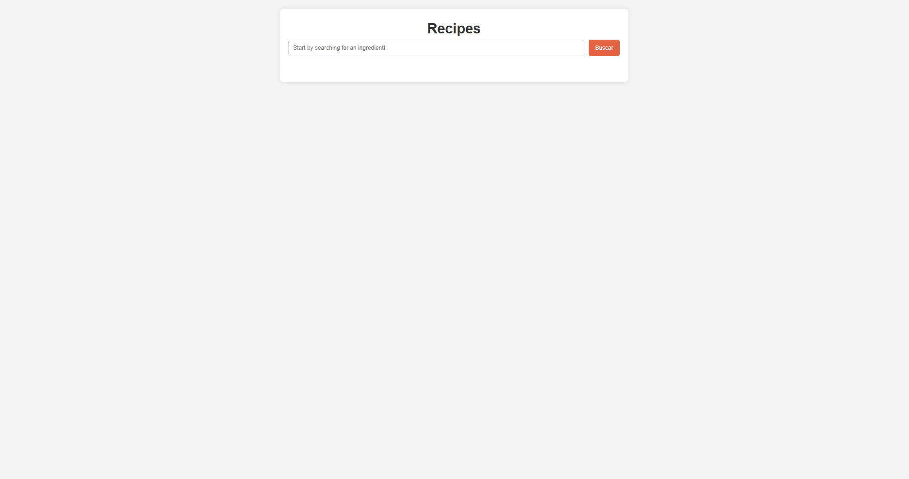
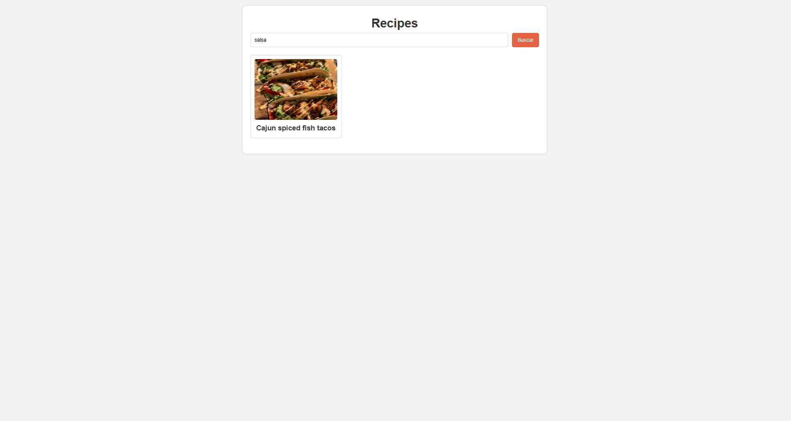
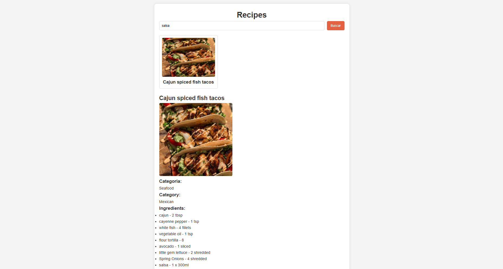

# 🍽️ Recipe Finder

Um projeto simples feito com **HTML**, **CSS** e **JavaScript**, que permite buscar receitas pelo **ID**, exibindo informações como:

- 📷 **Imagem** da receita  
- 🧂 **Lista de ingredientes**  
- 📖 **Instruções de preparo**  
- 🧾 **Nome da receita** e outras informações relevantes

## 💡 Funcionalidades

- 🔍 Busca de receitas por ID
- 🌐 Consumo de dados de uma API externa
- 📱 Interface simples, visual e responsiva
- 🚫 Tratamento de erros quando o ID não retorna resultados

## 🛠️ Tecnologias Utilizadas

- HTML5  
- CSS3  
- JavaScript 
- [TheMealDB API](https://www.themealdb.com/) 

## Preview do Site

### 1. Tela inicial para pesquisa



### 2. Receita sendo pesquisada



### 3. Informações detalhadas da receita




## 🚀 Como Usar

1. Clone o repositório:
   ```bash
   git clone https://github.com/seu-usuario/seu-repositorio.git

## 🎓 Fonte de Aprendizado
Este projeto foi desenvolvido com base no vídeo Build A Recipe App With JavaScript, do canal Dev Ed, no YouTube.

O projeto foi utilizado para fins de aprendizado, com adaptações e melhorias feitas ao longo do processo para reforçar os conhecimentos em HTML, CSS e JavaScript.
